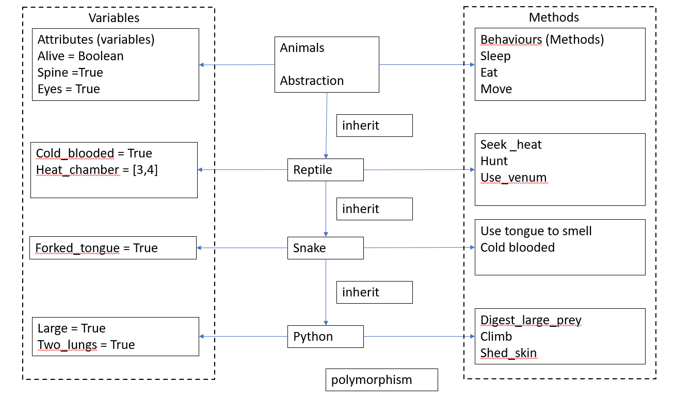

# OOP
 
- Create new project on pycharm 
- Create new github repo called python_oop 
- Create README.md in pycharm 
- Create a filed called animal.py – ENSURE THIS WORKS FIRST 
- Create a file called reptile.py and inherit animal (key words super class inhit)
- Create a filed called snake.py inherit reptile 
- Create a file called python.py inherit snake – polymorphism 
- How to create an object – initialize a class 


## Step 1 

````python
# create animal class
# syntax class Name:

class Animal:

    # --init-- to declare class attributes
    def __init__(self): #self refers to current class
        self.alive = True
        self.spine = True


    def sleep (self): #method called sleep for self class
        return "8 hours sleep is advised.."

    def eat (self):
        return "eat if you like to stay alive"

    # create an object of the class before using it


cat = Animal()

#print(cat.eat()) # absatracted how was eat created or what info is available

````
## Step 2

````python
# inherit everything from Animal class into reptiles

from animal import Animal

# create reptile class

class Reptile (Animal): # write name of class in (parent-class) to inherit
    # parent class - base class super class

    def __init__(self):
        #to let it know to inherit everything from parent class
        super().__init__() #super is used to inherit everything from base class (EXAMQ)
        self.cold_blooded = True
        self.heart_chambers = [3,4]

    def seek_heat(self):
        return "looking for sun shine"

    def hunt(self):
        return "catch next meal"

#  create object of reptile class

reptile_object = Reptile()

print(reptile_object.eat())
print(reptile_object.hunt())


````
## Step 3

````python
# inherit reptile from Reptile class


from reptile import Reptile

class Snake(Reptile):
    def __init__(self):
        super().__init__()
        self.forked_tongue = True


    def use_tongue_to_smell(self):
        return "i can use my tongue to smell food"

snake_object = Snake()

print(snake_object.eat()) # this function is inherited from Animal
print(snake_object.seek_heat()) # function is inherited from reptile
print(snake_object.use_tongue_to_smell()) # function from here

# create 2 more functions one with _ and the other with __
#execute them both - return message should explain encapsulation break down - public protected private

````